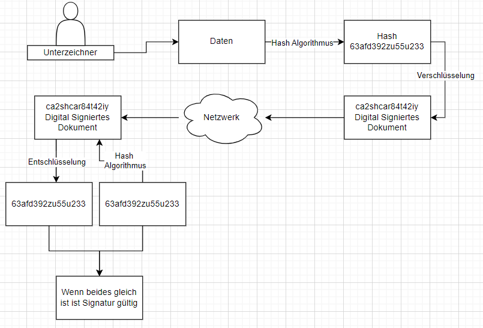

# FIDO - Anmeldeverfahren ohne Passwörter

## Warum sind Passwörter unsicher?
- Passwörter können leicht geknackt werden, insbesondere wenn sie schwach, wiederverwendet oder in Datenlecks offengelegt wurden.
- Phishing-Angriffe können Passwörter stehlen, indem Benutzer auf gefälschte Websites gelockt werden.
- Datenbanken, die Passwörter speichern, sind anfällig für Hacks, wodurch Millionen von Zugangsdaten kompromittiert werden können.
- Menschen verwenden oft leicht zu merkende, aber unsichere Passwörter wie "123456" oder "password".

## Wie geht ein passwortloses Anmeldeverfahren?
- Ein passwortloses Anmeldeverfahren nutzt **Public-/Private-Key-Kryptografie**:
  1. Der Benutzer registriert sich auf einem Gerät, das ein Schlüsselpaar erstellt (einen privaten und einen öffentlichen Schlüssel).
  2. Der öffentliche Schlüssel wird an den Server übertragen und gespeichert.
  3. Bei der Anmeldung sendet der Server eine Herausforderung (“Challenge”), die vom Gerät des Benutzers mit dem privaten Schlüssel signiert wird.
  4. Der Server überprüft die Signatur mit dem öffentlichen Schlüssel.

## Warum ist eine Anmeldung mit einem PIN auch gut?
- Ein PIN wird **lokal auf dem Gerät** verarbeitet, nicht an einen Server übertragen, wodurch Angriffe minimiert werden.
- Er ist einfach zu merken, sicherer als ein Passwort, da er durch Hardware (z. B. TPM oder Sicherheitschips) geschützt ist.
- In Kombination mit anderen Faktoren (z. B. Fingerabdruck oder Gesichtserkennung) wird die Sicherheit weiter erhöht.

## Was sind die "Faktoren" für ein Anmeldeverfahren?
Die Faktoren für die Authentifizierung können in drei Kategorien eingeteilt werden:
1. **Wissen**: Etwas, das der Benutzer weiß (z. B. Passwort, PIN).
2. **Besitz**: Etwas, das der Benutzer hat (z. B. Smartphone, Sicherheitsschlüssel).
3. **Biometrie**: Etwas, das der Benutzer ist (z. B. Fingerabdruck, Gesichtserkennung).

# Passkey - Wie kann man Passwörter ersetzen?

## Wie funktioniert das Public-/Private-Key-Verfahren?
- Der Benutzer’s Gerät erzeugt ein **Schlüsselpaar**:
  - Der **private Schlüssel** bleibt sicher auf dem Gerät des Benutzers.
  - Der **öffentliche Schlüssel** wird an den Server übertragen.
- Bei der Anmeldung sendet der Server eine Challenge.
- Der Benutzer signiert die Challenge mit dem privaten Schlüssel.
- Der Server validiert die Signatur mit dem öffentlichen Schlüssel.

## Wie geht das digitale Unterschreiben?
1. Der Server erstellt eine zufällige Challenge.
2. Diese Challenge wird an das Gerät des Benutzers gesendet.
3. Das Gerät signiert die Challenge mit dem privaten Schlüssel.
4. Die Signatur wird an den Server zurückgesendet.
5. Der Server prüft die Signatur mit dem öffentlichen Schlüssel.

### Zeichnung:

## Was ist der Vorteil dieses FIDO-Verfahrens?
- **Höhere Sicherheit**: Es gibt keine Passwörter, die gestohlen oder wiederverwendet werden können.
- **Phishing-Resistenz**: Ohne Passwörter kann ein Angreifer keine Anmeldeinformationen abfangen.
- **Einfachheit**: Benutzer müssen sich keine komplexen Passwörter merken.
- **Dezentrale Speicherung**: Private Schlüssel verbleiben auf dem Gerät des Benutzers.

## Warum ist dieses System noch nicht so verbreitet?
- **Kompatibilität**: Nicht alle Plattformen oder Geräte unterstützen FIDO noch vollständig.
- **Akzeptanz**: Benutzer und Unternehmen zögern, neue Technologien einzuführen.
- **Implementierungskosten**: Unternehmen müssen ihre Infrastruktur anpassen, um FIDO zu unterstützen.
- **Bildung**: Viele Menschen kennen die Vorteile passwortloser Anmeldungen noch nicht.
